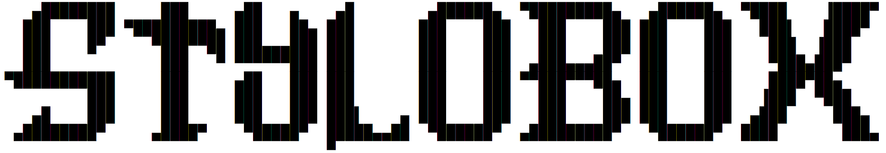
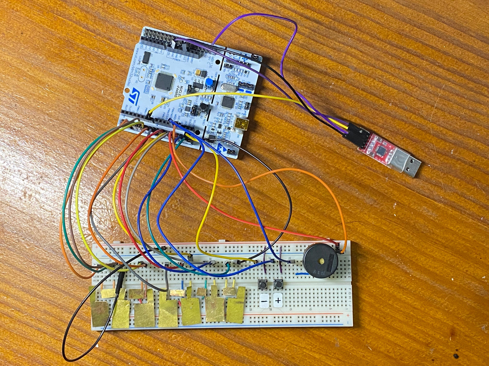
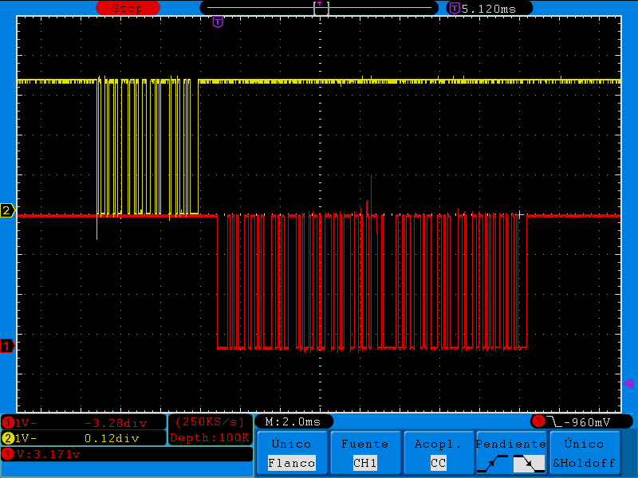
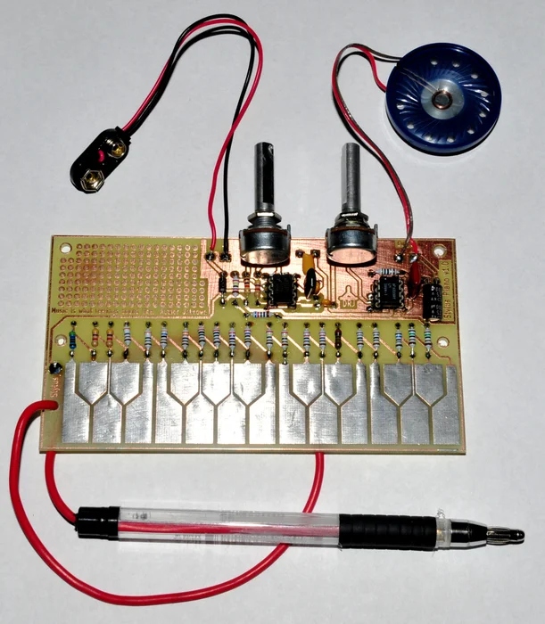
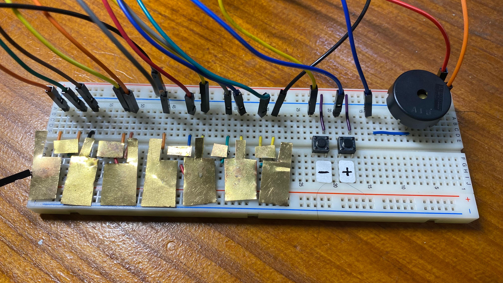

## Author

* **Rodrigo Pérez del Pulgar**

## Abstract

This project demonstrates how the Jukebox works using serial communication via the USART port with an STM32F446RE connected to a computer. It also uses a buzzer to play the notes and a user button to interact with the Jukebox. Additionally, the system integrates a stylophone feature, which allows the user to play notes by touching a stylus to a keyboard, with options to raise or lower octaves.

You can watch a demonstration of the project by **clicking the image below**:


[](https://drive.google.com/file/d/1yOv-qcCnx_iByAV9p9kVXI31Vn2bchAo/view?usp=sharing "Video demostration")


<!-- Puede añadir una imagen de portada **de su propiedad** aquí. Por ejemplo, del montaje final, o una captura de osciloscopio, etc. -->

<!-- **Las imágenes se deben guardar en la carpeta `docs/assets/imgs/` y se pueden incluir en el documento de la siguiente manera:**

```markdown

``` 

**Añada un enlace a un vídeo público de su propiedad aquí con la demostración del proyecto explicando lo que haya hecho en la versión V5.**

Para añadir un enlace a un vídeo de Youtube, puede usar el siguiente código:

```markdown
[](https://youtu.be/ID_DEL_VIDEO "Texto al pasar el ratón por encima de la imagen.")
``` -->

## Version 1
In Version 1, the system works with the user button only. The user button is connected to the pin PC13. The code uses the EXTI13 interrupt to detect the button press.

<!-- - Para poner un texto en negrita se usa el símbolo `**` de manera consecutiva. Por ejemplo: **Texto en negrita**
- Para poner un texto en cursiva se usa el símbolo `*` de manera consecutiva. Por ejemplo: *Texto en cursiva*
- Para poner un texto en cursiva y negrita se usa el símbolo `***` de manera consecutiva. Por ejemplo: ***Texto en cursiva y negrita***

Para añadir subsecciones se usa el símbolo `#` de manera consecutiva. Por ejemplo:

### Subsección 1
Breve descripción de la subsección 1.

Para añadir una lista de elementos se usa el símbolo `-` de manera consecutiva. Por ejemplo:

- Elemento 1
- Elemento 2
- Elemento 3

Para añadir una lista de elementos numerados se usa el símbolo `1.` de manera consecutiva. Por ejemplo:

1. Elemento 1
2. Elemento 2
3. Elemento 3

Para añadir un enlace a una página web se usa el siguiente código:

```markdown
Enlace a [Google](https://www.google.com).
```

Puede añadir tablas de la siguiente manera:

| Columna 1 | Columna 2 | Columna 3 |
| --------- | --------- | --------- |
| Valor 1   | Valor 2   | Valor 3   |
| Valor 4   | Valor 5   | Valor 6   |

Para añadir un enlace a un fichero `.c` o `.h` puede usar el siguiente código. Se trata de enlaces a ficheros `.html` que se generan automáticamente con la documentación del código al ejecutar Doxygen y que se encuentran en la carpeta `docs/html/`.

```markdown
Enlace a la [FSM de Version 1](fsm__button_8c.html).
```
 -->


## Version 2

In Version 2, the system works adds the serial communication. The code uses the USART3 port to receive the commands from the computer. The commands are implemented in Version 4.

## Version 3
In Version 3, the system adds the buzzer, controlling it with the PWM.


## Version 4
In Version 4 the system completes its FSM to interact with the user button and the serial communication. In this version it is also managed the sleep mode of the system. The systems sleeps constantly and awakes on the user button press or on the serial communication.

We can see here an example of an "info" message sent and its response, using the command line implemented in this version:




## Version 5

In version 5 the system is completed adding a stylophone, with the options of going up or down in octaves. 

We based our design on a classic stylophone, which works by having each note on the keyboard connected to a voltage-controlled oscillator via a different-value resistor. Touching the stylus to the keyboard thus closes a circuit. We have replaced the analog part of the oscillator with the STM32, which generates the signals based on the pressed key. Here is an example of a DIY stylophone:



To implement ours, we had to create the keys by recycling some old sensors, soldering pins to each key to place them on the breadboard, and adding two buttons, one to raise and another to lower the octave as an additional feature. This is the final result:



Enjoy the project!
